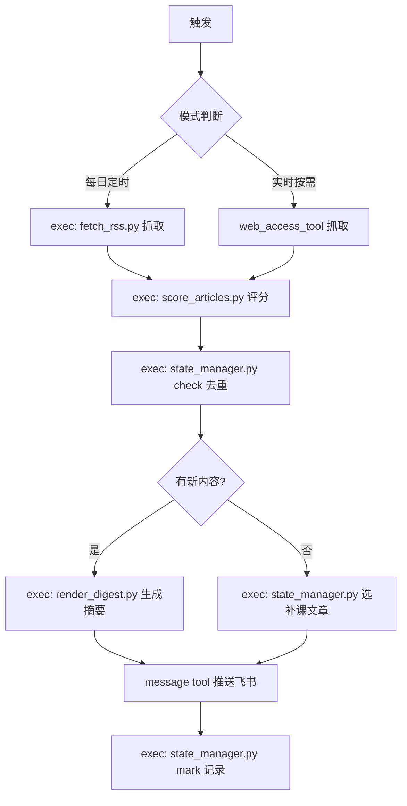
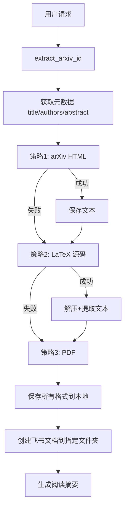

# AI Research Watch - AI 前沿研究每日雷达

## 触发条件
- 用户说"查最新研究""AI 雷达""research watch""今日 AI 资讯"
- Cron 定时任务触发（每日 09:00 Asia/Shanghai）
- 用户说"有没有突发文章"（实时模式）

## 工作流程



> ⚠️ 所有评分/去重/渲染逻辑由 Python 脚本执行，确保确定性。LLM 只负责「抓取」和「生成三句话摘要」。

## 脚本说明

| 脚本 | 作用 | 输入 | 输出 |
|------|------|------|------|
| `scripts/fetch_rss.py` | 抓取 RSS feed | URL 列表 | JSON 文章列表 |
| `scripts/score_articles.py` | 确定性评分 | 文章 JSON | 评分后 JSON |
| `scripts/state_manager.py` | 状态管理 | 子命令 | JSON 结果 |
| `scripts/render_digest.py` | 渲染推送文本 | 评分后 JSON | 格式化文本 |

### state_manager.py 子命令
- `stats` — 查看状态统计
- `check <url>` — 检查 URL 是否已推送
- `mark <url>` — 标记 URL 为已推送
- `check-title <title>` — 检查标题相似度去重
- `feedback <url> <up|down>` — 记录用户反馈
- `cleanup` — 清理 30 天前的记录

## 抓取策略

### 三层降级
1. **RSS 优先**：RSS 源直接解析 XML
2. **HTML 解析**：无 RSS 的页面用 web_access_tool 抓取
3. **搜索兜底**：前两者都失败时用 web_access_tool search

### 错误处理
- 单源失败不阻塞其他源，记录错误继续
- 所有源都失败时，推送"今日雷达异常"通知
- 超时阈值：单源 30 秒

## 评分规则

评分由 `scripts/score_articles.py` 确定性执行，规则如下：

### 正分（吸引关注）
| 条件 | 分数 |
|------|------|
| 官方 Research / Publication | +5 |
| System Card / Eval / Benchmark | +4 |
| Agent / Reasoning / Alignment / Safety | +3 |
| 模型发布 / 技术说明 | +2 |
| 含 eval_keywords.yml 中的关键词 | +1~3 |

### 负分（过滤噪音）
| 条件 | 分数 |
|------|------|
| 纯营销 / 招聘 / 合作新闻稿 | -3 |
| 非技术内容（office/funding） | -2 |
| 非官方二手转述 | -5 |
| 已在 seen.json 中 | 直接去重 |

## 去重机制
- **URL 精确去重**：seen.json 存已推送文章 URL
- **标题相似度去重**：标题 Jaccard 相似度 > 0.7 视为重复
- **保留天数**：seen.json 保留 30 天，超过自动清理

## 推送格式

```
📡 今日 AI 研究雷达 | {日期}

━━━━━━━━━━━━━━━━━━

{序号}. {标题}
📎 来源：{OpenAI / Anthropic / arXiv}
📂 类型：{Research / System Card / Eval / Model Release}
⭐ 重要程度：{★★★★★}
🔗 链接：{url}

💡 三句话总结：
• {解决什么问题}
• {用了什么方法}
• {对你的启发}

🎯 你需要关注：{关键词1}、{关键词2}

━━━━━━━━━━━━━━━━━━

{最多 3 篇新文章}

{如有补课文章}
📚 今日补课：
{补课文章摘要}
```

## 推送渠道
- **默认**：飞书私聊推送给用户（ou_0f523a90cdfbb1cc84ccf67ba3fcf7ef）
- **紧急/突发**：标题加 🔴 前缀

## 状态管理
- 状态文件：`state/seen.json`
- 格式：`{ "url": "2026-07-01", ... }`
- 每次推送后更新
- 30 天前的条目自动清理

## 反馈机制
- 推送后等待用户 👍/👎 反馈
- 连续 3 天 👎 的主题降权（评分 -1）
- 用户手动说"关注 XX"的主题加权（评分 +2）

## 补课机制
- 当天无新内容时触发
- 从 `references/evergreen_articles.yml` 中选取
- 优先选未推送过的
- 每篇最多推送 2 次后移出候选池

---

## 论文全文抓取（深度阅读模式）

### 触发条件
- 用户说"下载论文全文""获取论文原文""抓取论文""download paper" "fetch paper" "下载这篇文章" "把这篇搞下来"
- 用户给出 arXiv 链接/ID 要求获取内容
- 用户给出任意文章链接（博客/arXiv/新闻）要求下载
- 用户说"把这篇论文搞下来""原文在哪"

### 抓取策略（三路 fallback，确保成功）

| 优先级 | 策略 | 优点 | 缺点 |
|--------|------|------|------|
| 1️⃣ | arXiv HTML | 速度快、可读文本 | 非所有论文都有 |
| 2️⃣ | arXiv LaTeX 源码 | 含公式/代码/完整内容 | 需解压解析 |
| 3️⃣ | arXiv PDF | 总是可用 | 文本提取困难 |

**关键设计**：串行尝试，每步成功都继续尝试后续策略作为备份，最终选最佳格式。

### 工作流程



### 保存为飞书文档（强制规则）

抓取完成后，将论文内容保存为飞书文档，**必须遵守以下三条铁律**：

#### 铁律一：按 writing-guidelines.md 拆解

所有下载的文章必须按 `memory/writing-guidelines.md` 的章节模板拆解，不能只是搬运原文。

每个章节必须包含：
- `> 📌 一句话锚定`（blockquote）
- `## 🔍 为什么需要它？`（场景故事切入）
- `## 🧩 核心拆解`（文字拆解 + 对比表格 + 橙色 callout）
- `## ⚠️ 边学边踩坑`（问题→后果→方案表格）
- `## 🔗 关联章节`（前置预告 + 回溯引用）
- `## 📌 本章最该记住的一句话`
- `## 💬 面试准备`（蓝色 callout Q&A）

Callout 颜色语义（必须一致）：
- 🟠 橙色：核心定义、一句话理解
- 🔵 蓝色：面试话术
- 🔴 红色：踩坑、风险警告
- 🟡 黄色：关联章节
- 🟢 绿色：最佳实践

#### 铁律二：文档所有权授予用户

所有用 `feishu_lark_cli docs +create` 创建的文档，**必须确保用户拥有 full_access 权限**。
- 优先使用 `--as user` 创建（用户身份直接有文件夹权限）
- 如果用 `--as bot`，CLI 会自动尝试授权；自动授权失败时，手动调用 `feishu_lark_cli drive +permission` 授权
- **降级策略**：`--as bot` 报 `Permission denied` → 自动切换 `--as user` 重试
- 用户 open_id：`ou_0f523a90cdfbb1cc84ccf67ba3fcf7ef`

#### 铁律三：保存到指定文件夹

所有文档必须保存到用户指定的论文库文件夹：
- **目标文件夹 token**：`HkPgfPqEhl9Qbpdr4FCcfnTjnxe`
- **创建命令**：`feishu_lark_cli docs +create --api-version v2 --as user --parent-token HkPgfPqEhl9Qbpdr4FCcfnTjnxe --content '...'`
- **权限降级**：如果 `--as user` 不可用（如用户 OAuth 过期），改用 `--as bot` + 自动授权
- 创建后自动获得 full_access 权限

#### 文档命名
- **arXiv 论文**：`{日期}_{论文标题}`
- **博客文章**：`{日期}_{来源}_{文章标题}`

#### 文档内容结构模板
```xml
<title>{日期}_{标题}</title>
<callout emoji="💡" background-color="orange"><b>一句话理解</b>：{核心结论}</callout>
<p><i>来源：{来源链接} | 作者：{作者}</i></p>
<hr/>
# 第一章、{章节标题}
> 📌 {一句话锚定}
## 🔍 为什么需要它？
{场景故事}
## 🧩 核心拆解
{文字+表格+callout}
## ⚠️ 边学边踩坑
{踩坑表格}
## 🔗 关联章节
{双向织网表}
## 📌 本章最该记住的一句话
> {一句话}
## 💬 面试准备
<callout emoji="💬" background-color="blue">{Q&A}</callout>
<hr/>
{...后续章节...}

## 📎 下载链接
{根据文章类型选择对应格式}
```

#### 下载链接格式（按文章类型区分）

**arXiv 论文：**
```xml
<h1>📎 下载链接</h1>
<p>📄 <a href="https://arxiv.org/pdf/{ID}">PDF 全文</a> | 📋 <a href="https://arxiv.org/abs/{ID}">arXiv 页面</a> | 💻 <a href="{github_url}">GitHub 代码</a></p>
```
- 三个入口都有就全放，缺哪个就不放哪个，别凑数

**博客文章（Anthropic/OpenAI/Google 等）：**
```xml
<h1>📎 原文链接</h1>
<p>📄 <a href="{original_url}">原文</a> | 💻 <a href="{related_github}">相关代码/ Cookbook</a></p>
```
- 原文必放，相关代码/ Cookbook 有就放，没有就不放

**判断逻辑：**
- URL 含 `arxiv.org` → arXiv 论文格式
- 其他 → 博客文章格式

### 执行步骤

> ⚠️ **第 0 步（强制）**：收到下载请求后，必须先执行 `ls scripts/` 确认可用脚本，再按以下步骤操作。禁止凭记忆手动 curl/python 提取。下载必须用 `fetch_paper.py`，生成文档内容必须用 `render_paper_doc.py`。如脚本缺失，先报告用户再手动补全。

0. **检查工具链**：`ls scripts/` → 确认 `fetch_paper.py` 和 `render_paper_doc.py` 存在
1. **下载论文**：`python3 scripts/fetch_paper.py <ID> -o /tmp/papers` → 自动三路 fallback
2. **获取元数据**：从 `{ID}.result.json` 读取 title/authors/abstract
3. **生成文档内容**：构造 JSON → `python3 scripts/render_paper_doc.py -i data.json -o doc.xml`
4. **创建飞书文档**：用 `feishu_lark_cli` 逐章串行追加到指定文件夹（见铁律四~七）
5. **推送通知**：告知用户文档已创建，附飞书链接

### 脚本

| 脚本 | 作用 |
|------|------|
| `scripts/fetch_paper.py` | arXiv 论文下载（三路 fallback） |
| `scripts/render_paper_doc.py` | JSON → 飞书 DocxXML（按 writing-guidelines 模板渲染） |

#### render_paper_doc.py 用法

```bash
# 输入 JSON 文件，输出飞书 XML
python3 scripts/render_paper_doc.py -i paper_data.json -o doc.xml

# 仅校验 JSON 格式
python3 scripts/render_paper_doc.py -i paper_data.json --validate
```

JSON 输入格式见脚本内 docstring，核心字段：`title`, `arxiv_id`, `authors`, `source_url`, `one_liner`, `sections[]`。每个 section 包含 `title`, `anchor`, `why`, `core`, `pitfalls[]`, `related[]`, `remember`, `interview_qa[]`。

### 输出文件（本地临时）

| 文件 | 内容 |
|------|------|
| `{ID}.html.txt` | HTML 全文文本 |
| `{ID}-source.tar.gz` | LaTeX 源码压缩包 |
| `{ID}-src/*.tex` | 解压后的 .tex 文件 |
| `{ID}.latex.txt` | 提取的 LaTeX 纯文本 |
| `{ID}.pdf` | PDF 原文件 |
| `{ID}.result.json` | 元数据 + 下载结果 JSON |

### ⚠️ 飞书 API 铁律（防坑）

#### 铁律四：XML 属性一律用单引号

飞书 DocxXML 的 callout 等标签属性必须用**单引号**，不能用双引号：
- ✅ `<callout emoji='💡' background-color='orange'>`
- ❌ `<callout emoji="💡" background-color="orange">`

原因：双引号在 JSON 序列化时产生 `\"` 转义，导致 `feishu_lark_cli` 的 args 被识别为 string 而非 array，报 `args: must be array` 错误。

#### 铁律五：append 必须串行，禁止并行

`feishu_lark_cli docs +update --command append` 的 API **不保证并行调用的写入顺序**。
- ✅ 逐章顺序调用：第 1 章 append → 等返回 → 第 2 章 append → 等返回 → ...
- ❌ 同时发出多个 append 请求

违反此规则会导致章节顺序乱掉。

#### 铁律六：单次 append 不超过 1 章

单次 append 的内容过长会被截断或丢失格式。每次 append 只传**一个章节**的完整内容（含所有子模块：锚定/为什么/核心拆解/踩坑/关联/面试）。如果一章内容仍然太长，拆分为“核心拆解”和“踩坑+关联+面试”两次 append。

#### 铁律七：overwrite 前先确认

使用 `--command overwrite` 会**清空整个文档**。仅在以下场景使用：
- 文档刚创建，只有骨架需要重写
- 用户明确要求重写
- 不要在有内容的文档上 overwrite
