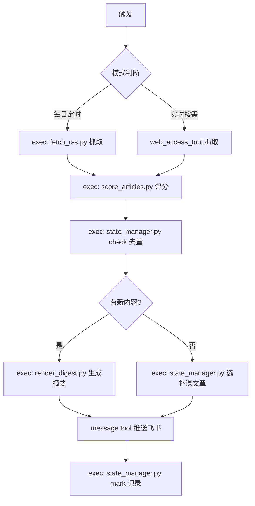

# AI Research Watch - AI 前沿研究每日雷达

## 触发条件
- 用户说"查最新研究""AI 雷达""research watch""今日 AI 资讯"
- Cron 定时任务触发（每日 09:00 Asia/Shanghai）
- 用户说"有没有突发文章"（实时模式）

## 工作流程



> ⚠️ 所有评分/去重/渲染逻辑由 Python 脚本执行，确保确定性。LLM 只负责「抓取」和「生成三句话摘要」。

## 脚本说明

| 脚本 | 作用 | 输入 | 输出 |
|------|------|------|------|
| `scripts/fetch_rss.py` | 抓取 RSS feed | URL 列表 | JSON 文章列表 |
| `scripts/score_articles.py` | 确定性评分 | 文章 JSON | 评分后 JSON |
| `scripts/state_manager.py` | 状态管理 | 子命令 | JSON 结果 |
| `scripts/render_digest.py` | 渲染推送文本 | 评分后 JSON | 格式化文本 |

### state_manager.py 子命令
- `stats` — 查看状态统计
- `check <url>` — 检查 URL 是否已推送
- `mark <url>` — 标记 URL 为已推送
- `check-title <title>` — 检查标题相似度去重
- `feedback <url> <up|down>` — 记录用户反馈
- `cleanup` — 清理 30 天前的记录

## 抓取策略

### 三层降级
1. **RSS 优先**：RSS 源直接解析 XML
2. **HTML 解析**：无 RSS 的页面用 web_access_tool 抓取
3. **搜索兜底**：前两者都失败时用 web_access_tool search

### 错误处理
- 单源失败不阻塞其他源，记录错误继续
- 所有源都失败时，推送"今日雷达异常"通知
- 超时阈值：单源 30 秒

## 评分规则

评分由 `scripts/score_articles.py` 确定性执行，规则如下：

### 正分（吸引关注）
| 条件 | 分数 |
|------|------|
| 官方 Research / Publication | +5 |
| System Card / Eval / Benchmark | +4 |
| Agent / Reasoning / Alignment / Safety | +3 |
| 模型发布 / 技术说明 | +2 |
| 含 eval_keywords.yml 中的关键词 | +1~3 |

### 负分（过滤噪音）
| 条件 | 分数 |
|------|------|
| 纯营销 / 招聘 / 合作新闻稿 | -3 |
| 非技术内容（office/funding） | -2 |
| 非官方二手转述 | -5 |
| 已在 seen.json 中 | 直接去重 |

## 去重机制
- **URL 精确去重**：seen.json 存已推送文章 URL
- **标题相似度去重**：标题 Jaccard 相似度 > 0.7 视为重复
- **保留天数**：seen.json 保留 30 天，超过自动清理

## 推送格式

```
📡 今日 AI 研究雷达 | {日期}

━━━━━━━━━━━━━━━━━━

{序号}. {标题}
📎 来源：{OpenAI / Anthropic / arXiv}
📂 类型：{Research / System Card / Eval / Model Release}
⭐ 重要程度：{★★★★★}
🔗 链接：{url}

💡 三句话总结：
• {解决什么问题}
• {用了什么方法}
• {对你的启发}

🎯 你需要关注：{关键词1}、{关键词2}

━━━━━━━━━━━━━━━━━━

{最多 3 篇新文章}

{如有补课文章}
📚 今日补课：
{补课文章摘要}
```

## 推送渠道
- **默认**：飞书私聊推送给用户（ou_0f523a90cdfbb1cc84ccf67ba3fcf7ef）
- **紧急/突发**：标题加 🔴 前缀

## 状态管理
- 状态文件：`state/seen.json`
- 格式：`{ "url": "2026-07-01", ... }`
- 每次推送后更新
- 30 天前的条目自动清理

## 反馈机制
- 推送后等待用户 👍/👎 反馈
- 连续 3 天 👎 的主题降权（评分 -1）
- 用户手动说"关注 XX"的主题加权（评分 +2）

## 补课机制
- 当天无新内容时触发
- 从 `references/evergreen_articles.yml` 中选取
- 优先选未推送过的
- 每篇最多推送 2 次后移出候选池
